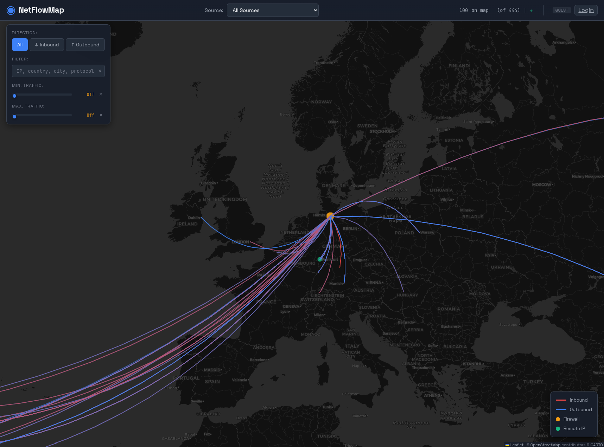

# NetFlowMap

A real-time NetFlow visualization tool that displays network traffic on an interactive world map. Built with Go and designed for use with firewalls and routers that support NetFlow v9.

NetFlowMap was **developed entirely with AI** as an exploratory project. There might be dragons. 🐉



## Features

- **Real-time Visualization**: Watch network flows appear on a world map as they happen via WebSocket
- **Multiple Sources**: Configure and monitor multiple NetFlow sources simultaneously
- **GeoIP Enrichment**: Automatic IP geolocation using DB-IP Lite database
- **Traffic Analysis**: 
  - Top 100 flows sorted by bandwidth
  - Aggregated traffic per remote IP
  - Min./Max. Traffic filter slider to focus on large/small transfers
- **Sampling Support**: Automatic detection of NetFlow sampling with optional extrapolation
- **FortiGate Integration**: Optional integration to resolve IP addresses to FortiGate address objects
- **Traffic Filtering**: Filter by direction (inbound/outbound), IP addresses, countries, or text search
- **Authentication**: Optional authentication with local users or OpenID Connect (OIDC)
- **Role-based Access**: Admin, User, and Anonymous roles with different visibility levels
- **Admin Health Dashboard**: Real-time system statistics including memory usage, goroutines, and flow metrics
- **Responsive UI**: Works on desktop and mobile browsers

## Requirements

- **Docker** (recommended) or Go 1.21+
- A NetFlow v9 source (e.g., FortiGate, OPNsense, Cisco router, etc.)

---

## Quick Start with Docker

The easiest way to run NetFlowMap:

1. **Download example configuration**
   ```bash
   curl -O https://raw.githubusercontent.com/RiskIdent/NetFlowMap/main/configs/config.example.yml
   mv config.example.yml config.yml
   # Edit config.yml with your settings
   ```

2. **Run the container**
   ```bash
   docker run -d \
     -p 8080:8080 \
     -p 2055:2055/udp \
     -v $(pwd)/config.yml:/app/config.yml:ro \
     ghcr.io/riskident/netflowmap:latest
   ```

3. **Access the web interface**
   
   Open http://localhost:8080 in your browser.

---

## Quick Start with Docker Compose

1. **Download the required files**
   ```bash
   curl -O https://raw.githubusercontent.com/RiskIdent/NetFlowMap/main/docker-compose.yml
   curl -O https://raw.githubusercontent.com/RiskIdent/NetFlowMap/main/configs/config.example.yml
   mv config.example.yml config.yml
   # Edit config.yml with your settings
   ```

2. **Start with Docker Compose**
   ```bash
   docker compose up -d
   ```

3. **Access the web interface**
   
   Open http://localhost:8080 in your browser.

### Docker Compose Ports

| Port | Protocol | Description |
|------|----------|-------------|
| 8080 | TCP | Web UI |
| 2055 | UDP | NetFlow collector |

### Volumes

| Path | Description |
|------|-------------|
| `config.yml` | Your configuration (required) |
| `users.yml` | Local user credentials (optional) |
| `netflowmap-data` | GeoIP database storage (persistent) |

### Custom Ports

To change ports, edit `docker-compose.yml`:

```yaml
ports:
  - "8080:8080"      # Change left side for different host port
  - "9995:2055/udp"  # Example: Use port 9995 for NetFlow
```

---

## Manual Installation

1. **Clone the repository**
   ```bash
   git clone https://github.com/RiskIdent/NetFlowMap.git
   cd NetFlowMap
   ```

2. **Create configuration**
   ```bash
   cp configs/config.example.yml config.yml
   ```

3. **Build and run**
   ```bash
   go build -o netflowmap ./cmd/netflowmap
   ./netflowmap
   ```

4. **Access the web interface**
   
   Open http://localhost:8080 in your browser.

---

## Configuration

See `configs/config.example.yml` for a complete configuration example.

### NetFlow Sources

Each source represents a device sending NetFlow data to NetFlowMap:

```yaml
sources:
  - id: "fw-main"
    name: "Main Firewall"
    source_ip: "192.168.1.1"    # IP address of the NetFlow exporter
    latitude: 52.52             # Geographic location for map display
    longitude: 13.405
```

### Flow Display Settings

```yaml
flows:
  # How long flows remain visible after last update (seconds)
  display_timeout_seconds: 60
  
  # Maximum number of flows to display (sorted by bandwidth)
  max_display_flows: 100
```

### Logging

Configure the log level in `config.yml`:

```yaml
log_level: info  # Options: trace, debug, info, warning, error
```

| Level | Description |
|-------|-------------|
| `trace` | Very verbose, includes per-flow details |
| `debug` | Debug information, filter operations |
| `info` | Normal operation messages (default) |
| `warning` | Warnings only |
| `error` | Errors only |

### Sampling Configuration

If your NetFlow exporter uses packet sampling (e.g., 1:100), NetFlowMap can detect this automatically via NetFlow Options Templates. As a fallback, you can configure it manually:

```yaml
sources:
  - id: "fw-main"
    name: "Main Firewall"
    source_ip: "192.168.1.1"
    latitude: 52.52
    longitude: 13.405
    sampling_interval: 100  # 1:100 sampling
```

When sampling is detected, an "Extrapolate sampled data" toggle appears in the UI to estimate real traffic values.

### FortiGate Integration (Optional)

Resolve remote IP addresses to FortiGate address object names:

```yaml
sources:
  - id: "fw-main"
    name: "Main Firewall"
    source_ip: "192.168.1.1"
    latitude: 52.52
    longitude: 13.405
    fortigate:
      host: "https://192.168.1.1"
      token: "your-api-token"
      verify_ssl: false
```

---

## Authentication

NetFlowMap supports optional authentication with role-based access control.

### Roles

| Role | Access Level |
|------|--------------|
| **Admin** | Full access to all data including private IPs |
| **User** | Access to public IPs only, private IPs are masked |
| **Anonymous** | Can view the map but all IP addresses are hidden |

### Local Authentication

1. **Generate a password hash**

   **With Docker Compose:**
   ```bash
   docker compose run --rm netflowmap --hash-password
   ```

   **With local binary:**
   ```bash
   ./netflowmap --hash-password
   ```

   You will be prompted to enter and confirm your password (input is hidden).

2. **Create users.yml**
   ```bash
   cp configs/users.example.yml users.yml
   ```

3. **Add users to users.yml**
   ```yaml
   users:
     - username: admin
       role: admin
       password_hash: "$2a$10$..."
     
     - username: viewer
       role: user
       password_hash: "$2a$10$..."
   ```

4. **Enable authentication in config.yml**
   ```yaml
   auth:
     enabled: true
     session_secret: "your-secret-key-min-16-chars"
     session_duration: 12h
     local:
       enabled: true
       users_file: "users.yml"
   ```

### OIDC Authentication

Connect to an OpenID Connect provider (Keycloak, Authentik, etc.):

```yaml
auth:
  enabled: true
  session_secret: "your-secret-key-min-16-chars"
  session_duration: 12h
  oidc:
    enabled: true
    issuer_url: "https://auth.example.com/realms/main"
    client_id: "netflowmap"
    client_secret: "your-client-secret"
    redirect_url: "http://localhost:8080/auth/callback"
    admin_users:
      - "admin@example.com"
      - "kai"
```

- All OIDC-authenticated users receive the **User** role by default
- Users listed in `admin_users` receive the **Admin** role

---

## UI Features

### Traffic Filter Slider

Use the "Min. Traffic" slider to filter out small connections and focus on large data transfers. The slider supports values from 0 (disabled) up to 1 GB.

### Direction Filter

- **All**: Show both inbound and outbound flows
- **Inbound**: Show only traffic coming into your network (red lines)
- **Outbound**: Show only traffic leaving your network (blue lines)

### Text Filter

Search for flows by:
- IP address
- Country or city name
- Protocol (TCP, UDP, ICMP)
- FortiGate address object name

### Remote IP Details

Click on a remote IP marker (green dot) to see:
- Traffic summary (total bytes, inbound/outbound split)
- Organization and ASN information
- All active connections to that IP

### Health Dashboard (Admin only)

Click the "Health" button in the header to view:
- NetFlowMap version and uptime
- Connected clients and flow statistics
- Per-source flow counts and address objects
- Go runtime metrics (memory, goroutines, GC)
- System CPU and memory usage

The dashboard auto-refreshes every 10 seconds.

---

## Architecture

```
NetFlowMap/
├── cmd/netflowmap/      # Application entry point
├── internal/
│   ├── auth/            # Authentication (local + OIDC)
│   ├── config/          # Configuration parsing
│   ├── flowstore/       # In-memory flow storage
│   ├── fortigate/       # FortiGate API client
│   ├── geoip/           # GeoIP database management
│   ├── logging/         # Structured logging
│   ├── netflow/         # NetFlow v9 collector & parser
│   └── web/             # HTTP server, handlers, WebSocket
├── web/
│   ├── static/          # CSS, JavaScript
│   └── templates/       # HTML templates
├── configs/             # Example configurations
└── data/                # GeoIP database files
```

---

## Troubleshooting

### No flows appearing

1. Check that your firewall is sending NetFlow to the correct IP and port (default: 2055/UDP)
2. Verify the `source_ip` in your config matches the IP your firewall uses to send NetFlow
3. Check the logs: `./netflowmap` or `docker compose logs -f`

### Flows not showing on map

- Only flows between public and private IPs are displayed
- Private-to-private or public-to-public flows are not shown on the map
- Check the "flows" counter in the header to see if flows are being received

### Large downloads not visible

- NetFlowMap displays the top 100 flows sorted by bandwidth
- Use the "Min. Traffic" slider to filter out small connections
- Ensure your NetFlow active/inactive timeouts are configured appropriately

---

## License

MIT License - see LICENSE file for details.

For information about third-party components and their licenses, see [LicenseInfo.md](LicenseInfo.md).

## Contributing

Contributions are welcome! Please open an issue or submit a pull request.
